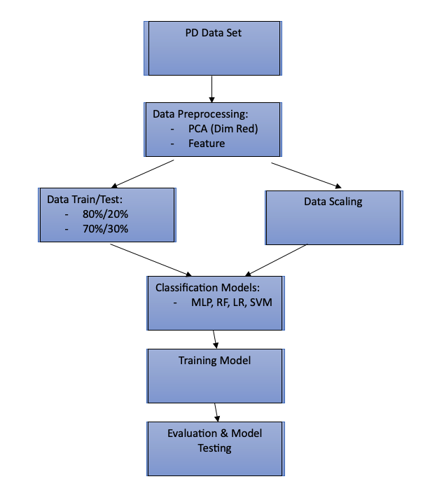

# Predictive Modeling for Parkinson's Disease Diagnosis Using Speech Signal Features

## Introduction

Parkinson’s disease (PD) stands as the second most prevalent neurodegenerative condition globally, affecting millions with its progressive motor impairments and non-motor symptoms. With the demographic shift towards an aging population, the incidence of PD has doubled between 1990 and 2015. Early diagnosis is crucial for effective management, yet reliable diagnostic tests are lacking, relying heavily on clinical criteria. Leveraging machine learning techniques, particularly in analyzing speech patterns, offers a promising avenue for early detection. This paper aims to employ supervised machine learning methods to classify PD patients based on speech recordings, potentially revolutionizing diagnosis and intervention strategies. Through a comprehensive evaluation of machine learning classifiers and feature selection techniques, this study seeks to enhance accuracy and efficiency in PD identification, thus addressing a critical need in neurodegenerative disease management.

## Dataset

The dataset utilized in this study comprises records from 252 individuals, consisting of 130 males and 122 females, each contributing three observations. This results in a total of 756 instances and 754 attributes, with one binary decision variable indicating Parkinson's disease (PD) or healthy status. Among the participants, 188 were diagnosed with PD, with ages ranging from 33 to 87 years and a mean age of 65.1±10.9, while the remaining 64 individuals were healthy, aged between 41 and 82 years with a mean age of 61.1±8.9. The dataset includes voice recordings collected at a 44.1 kHz frequency, focusing on sustained phonation of the vowel "a." Various speech signal processing algorithms were applied to extract features such as Time-Frequency Features, Mel Frequency Cepstral Coefficients (MFCCs), Wavelet Transform based Features, Vocal Fold Features, and Tunable Q-factor wavelet transform (TWQT) features. Additionally, baseline features including jitter, shimmer, recurrence period density entropy (RPDE), fundamental frequency parameters, Detrended Fluctuation Analysis (DFA), harmonicity parameters, and Pitch Period Entropy (PPE) were extracted. This comprehensive dataset contains 756 observations and 755 features, facilitating machine learning classifiers' analysis to extract valuable insights for PD diagnosis.

## Methodology

### Pre-processing

The dataset with 756 observations and 755 features is loaded using Pandas. Features are standardized with StandardScaler, then reduced to 25 principal components using PCA. Top 19 features are selected based on Spearman correlation coefficients with the target variable. These features undergo variance scaling with MinMaxScaler to ensure values fall between 0 and 1. The resulting preprocessed dataset, including selected features and the target variable, is ready for analysis.

## Results

## Discussion
