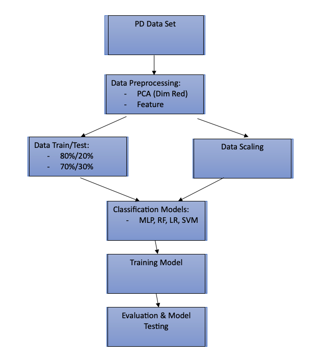
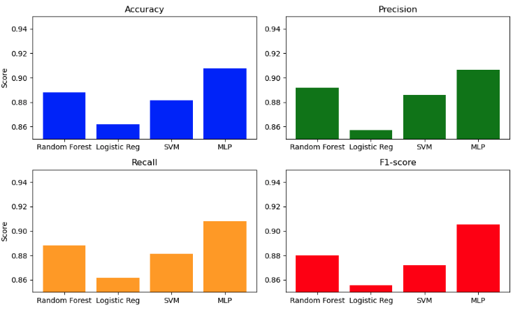
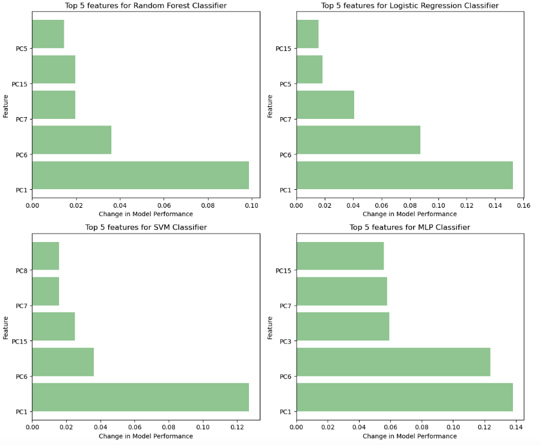

# Predictive Modeling for Parkinson's Disease Diagnosis Using Speech Signal Features

## Introduction

Parkinson’s disease (PD) stands as the second most prevalent neurodegenerative condition globally, affecting millions with its progressive motor impairments and non-motor symptoms. With the demographic shift towards an aging population, the incidence of PD has doubled between 1990 and 2015. Early diagnosis is crucial for effective management, yet reliable diagnostic tests are lacking, relying heavily on clinical criteria. Using machine learning techniques, particularly in analyzing speech patterns, offers a promising avenue for early detection. This project aims to employ machine learning methods to classify PD patients based on speech recordings, possibly changing diagnosis and intervention strategies. Through a comprehensive evaluation of machine learning classifiers and feature selection techniques, this study seeks to enhance accuracy and efficiency in PD identification, thus addressing a critical need in neurodegenerative disease management.

## Dataset

The dataset utilized in this study comprises records from 252 individuals, consisting of 130 males and 122 females, each contributing three observations. This results in a total of 756 instances and 754 attributes, with one binary decision variable indicating Parkinson's disease or healthy status. Among the participants, 188 were diagnosed with PD, with ages ranging from 33 to 87 years, while the remaining 64 individuals were healthy, aged between 41 and 82 years. The dataset includes voice recordings collected at a 44.1 kHz frequency, focusing on sustained phonation of the vowel "a." Various speech signal processing algorithms were applied to extract features such as Time-Frequency Features, Mel Frequency Cepstral Coefficients (MFCCs), Wavelet Transform based Features, Vocal Fold Features, and Tunable Q-factor wavelet transform (TWQT) features. Additionally, baseline features including jitter, shimmer, recurrence period density entropy (RPDE), fundamental frequency parameters, Detrended Fluctuation Analysis (DFA), harmonicity parameters, and Pitch Period Entropy (PPE) were extracted. This comprehensive dataset contains 756 observations and 755 features, facilitating machine learning classifiers' analysis to extract valuable insights for PD diagnosis.

## Methodology

### Pre-processing

The dataset is loaded using Pandas. Features are standardized with StandardScaler, then reduced to 25 principal components using PCA. Top 19 features are selected based on Spearman correlation coefficients with the target variable. These features undergo variance scaling with MinMaxScaler to ensure values fall between 0 and 1. The resulting preprocessed dataset, including selected features and the target variable, is ready for analysis.

### Model Training

For model training, the Random Forest (RF) classifier, Logistic Regression (LR) classifier, Support Vector Machine (SVM) classifier, and Multi-layer Perceptron (MLP) classifier were employed. Each model was trained on the reduced dataset, splitting it into training and testing sets using an 80-20 ratio. For RF, LR, and SVM, standard fitting procedures were followed, while the MLP classifier utilized a partial fit method due to its online learning nature, iterating over 800 epochs. Evaluation metrics such as accuracy, precision, recall, F1-score, classification report, and confusion matrix were computed for each model, facilitating a comprehensive assessment of their performance.

## Results

- Random Forest achieved an accuracy of 88.82%, precision of 89.18%, recall of 88.82%, and an F1-score of 88.00%. The most important features by permutation importance were PC1, PC6, PC7, PC15, and PC5.
- Logistic Regression attained an accuracy of 86.18%, precision of 85.73%, recall of 86.18%, and an F1-score of 85.55%. PC1, PC6, PC7, PC5, and PC15 were identified as the top five important features.
- Support Vector Machine achieved an accuracy of 88.16%, precision of 88.58%, recall of 88.16%, and an F1-score of 87.21%. The most influential features were PC1, PC6, PC15, PC7, and PC8.
- Multi-Layer Perceptron exhibited the highest accuracy at 90.79%, precision at 90.64%, recall at 90.79%, and F1-score at 90.52%. The most significant features were PC1, PC6, PC3, PC7, and PC15.

The top three features overall across the four models, based on permutation importance, were PC1, PC6, and PC7. These features consistently exhibited high importance across RF, LR, SVM, and MLP classifiers, indicating their significant contribution to the predictive performance of the models.

## Discussion

The application of these machine learning techniques shows promising results in PD diagnosis. The study demonstrates the efficacy of Random Forest, Logistic Regression, Support Vector Machine, and Multi-Layer Perceptron classifiers in accurately identifying PD patients based on speech recordings, achieving high accuracies ranging from 86.18% to 90.79%. Notably, features such as PC1, PC6, and PC7 consistently emerged as crucial contributors to the models' predictive performance, emphasizing their importance in PD classification. Specifically, attributes like “app_LT_entropy_shannon_6_coef”, “tqwt_TKEO_mean_dec_34”, and “std_5th_delta” were among the top contributors to PC1, PC6, and PC7, respectively. However, despite these advancements, there are limitations to consider. The current method relies on a relatively small dataset and may lack generalizability across diverse populations. Moreover, future research should explore integrating additional clinical data and leveraging more sophisticated feature engineering techniques to further enhance model robustness and diagnostic accuracy. Nonetheless, the findings underscore the potential of machine learning-driven approaches in revolutionizing early PD detection and intervention strategies, offering new avenues for improving neurodegenerative disease management.

## References

Biswas, Dipayan. “Parkinson’s Disease (PD) Classification.” Www.kaggle.com, www.kaggle.com/datasets/dipayanbiswas/parkinsons-disease-speech-signal-features/data. 

Serbes, Gorkem, and Aysegul Gunduz. “UCI Machine Learning Repository.” Archive.ics.uci.edu, archive.ics.uci.edu/dataset/470/parkinson+s+disease+classification.

Sowmya, Doneti. “Parkinson’s Disease Detection by MachineLearning Using SVM.” SlideShare, 9 Feb. 2023, www.slideshare.net/irjetjournal/parkinsons-disease-detection-by-machinelearning-using-svm.

